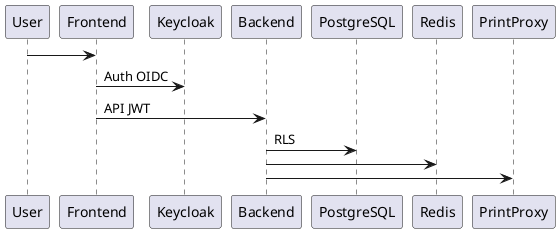
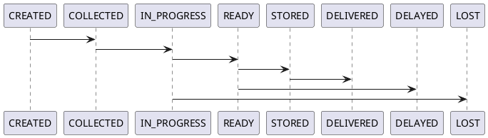

# SPEC-001 – CleanTrack Pro (SaaS de Gestion de Pressing)

## Background

Le secteur du pressing souffre encore largement d’outils hétérogènes, peu digitalisés et non adaptés à la gestion multi-site et multi-entreprises. Les problématiques récurrentes incluent la perte de linge, le manque de traçabilité, l’absence de visibilité financière consolidée et des processus opérationnels manuels.

CleanTrack Pro vise à fournir une plateforme SaaS moderne, multi-tenant, orientée terrain, permettant de gérer l’intégralité du cycle de vie du linge tout en offrant aux promoteurs une vision financière fiable et centralisée.

---

## Requirements

### Must Have

* Gestion multi-tenant stricte (entreprises isolées)
* Gestion multi-site par tenant
* IAM centralisé (Keycloak) incluant **clients finaux**
* Traçabilité complète des commandes via QR Code
* Gestion Normal / Express avec priorisation
* Rangement physique par rayons/slots
* Impression thermique opérationnelle en agence
* Recherche client instantanée (omnibox)

### Should Have

* Calcul automatique de marge nette
* Portail client (web + mobile)
* Historique des commandes et notifications

### Could Have

* Fidélité digitale
* Analytics avancées
* API partenaires (livraison externe)

### Won’t Have (MVP)

* Facturation électronique réglementaire
* IA prédictive

---

## Method

### 1. Architecture Générale

* **Frontend Web** : Next.js 14 (Admin, Opérateurs, Clients)
* **Mobile Client** : React Native (phase MVP étendue)
* **Backend** : NestJS (modulaire)
* **Auth** : Keycloak (OIDC, multi-realm ou realm unique + tenant claim)
* **Database** : PostgreSQL avec RLS
* **Cache** : Redis (sessions, omnibox)
* **Impression** : Print Proxy local (Node.js) + ESC/POS



---

### 2. IAM & Sécurité

#### Rôles

* Superadmin
* Admin_Tenant
* Admin_Site
* User_Site
* Client

Tous les utilisateurs (y compris clients) possèdent un compte Keycloak.

#### Claims JWT

* tenant_id
* site_ids[]
* role

#### Isolation

* RLS PostgreSQL basé sur tenant_id
* Vérification systématique côté NestJS Guards

---

### 3. Modèle Métier & Données

#### Clients

* Client unique par tenant
* Utilisable dans tous les sites du tenant

#### Commandes

États étendus :

* CREATED
* COLLECTED
* IN_PROGRESS
* READY
* STORED
* DELIVERED
* CANCELLED
* LOST
* DELAYED

#### Articles & Stockage

```sql
CREATE TABLE order_items (
  id UUID PRIMARY KEY,
  order_id UUID,
  label VARCHAR(50),
  quantity INT
);

CREATE TABLE shelf_slots (
  id UUID PRIMARY KEY,
  site_id UUID,
  label VARCHAR(50),
  status VARCHAR(20) -- FREE, RESERVED, OCCUPIED
);

CREATE TABLE order_storage (
  id UUID PRIMARY KEY,
  order_id UUID,
  shelf_slot_id UUID,
  stored_at TIMESTAMP
);
```

* Relation N:N entre commandes et slots
* Verrouillage transactionnel lors de l’attribution (`SELECT FOR UPDATE`)

---

### 4. Workflow Commande



* Les commandes EXPRESS sont priorisées en file de production
* SLA calculé automatiquement

---

### 5. Logistique de Rangement

* Slots créés par Admin_Site
* Suggestion automatique de slot libre
* Réservation temporaire lors de la sélection
* Visualisation temps réel

---

### 6. Impression Thermique

#### Architecture

* Print Proxy obligatoire en agence
* API locale HTTP
* Support ESC/POS

#### Supports

* Ticket client (80mm)
* Étiquette linge

QR Code = order_id signé

---

### 7. Performance & Recherche

* Index DB :

    * (tenant_id, phone)
    * (tenant_id, last_name)
* Téléphones normalisés (E.164)
* Limitation résultats omnibox (TOP 10)
* Cache Redis (30s)

---

## Implementation

1. Setup infrastructure (DB, Keycloak, Redis)
2. Mise en place RLS PostgreSQL
3. Modules NestJS : Auth, Tenant, Client, Order, Storage, Print
4. Print Proxy local
5. Frontend Admin / Opérateur
6. Portail Client
7. Tests terrain en pressing pilote

---

## Milestones

| Phase | Objectif                         |
| ----- | -------------------------------- |
| M1    | Auth + Multi-tenant opérationnel |
| M2    | Commandes + Clients              |
| M3    | Impression + Rangement           |
| M4    | Portail Client                   |
| M5    | Reporting & Stabilisation        |

---

## Gathering Results

* KPI perte linge = 0
* Temps réception < 1 min
* Disponibilité plateforme > 99.5%
* Adoption opérateurs
* Satisfaction clients finaux

---
